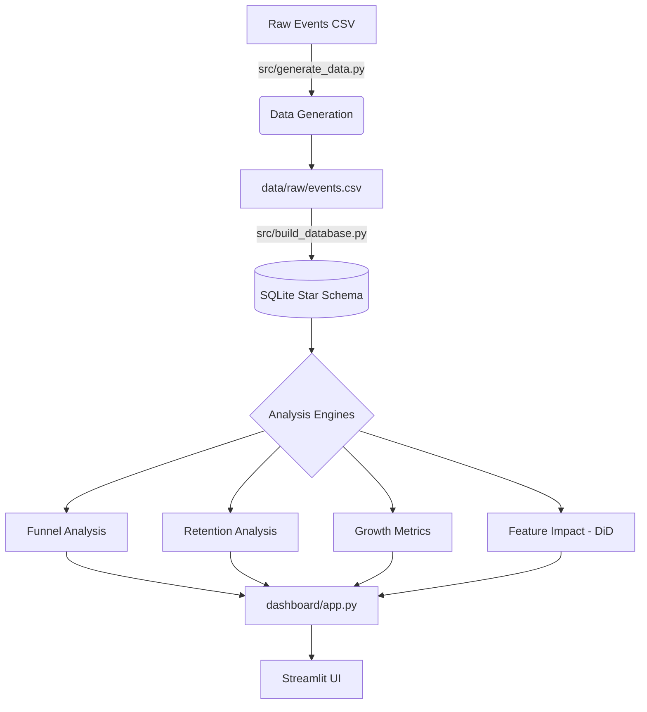

# GrowthLens

  

> **GrowthLens** is an end-to-end Product Analytics platform that transforms high-volume e-commerce clickstream data into actionable business insights. It provides professional-grade modules for funnel tracking, cohort retention, growth accounting, and causal feature-impact analysis.

## 📖 Table of Contents
- [🎥 Dashboard Demo](#dashboard-demo)
- [📷 Architecture Diagram](#architecture-diagram)
- [🚀 Overview](#-overview)
- [✨ Key Features](#-key-features)
- [🏗️ Architecture & Tech Stack](#%EF%B8%8F-architecture--tech-stack)
- [📁 Directory Structure](#-directory-structure)
- [🛠️ Getting Started](#%EF%B8%8F-getting-started)
- [🔌 API Reference / Usage](#-api-reference--usage)
- [🤝 Contributing](#-contributing)
- [📜 License](#-license)


## Dashboard Demo
https://github.com/user-attachments/assets/fb7d6617-6d67-466a-8dff-c662f1718014

## Architecture Diagram



## 🚀 Overview
GrowthLens solves the gap between raw behavioral event logs and strategic decision-making. Designed for Product Managers and Data Analysts, the platform handles the entire data lifecycle: from generating synthetic datasets that mirror real-world e-commerce patterns (like REES46) to modeling a SQLite Star Schema and performing complex statistical analyses like Difference-in-Differences (DiD).

Unlike basic dashboards, GrowthLens accounts for seasonality and external factors, ensuring that "impact" metrics represent true incremental growth rather than just baseline trends.

## ✨ Key Features

- **Funnel Analytics**: Measures conversion rates across the View → Cart → Purchase lifecycle. It uses an event-based model that allows for multi-session conversions, reflecting real shopping behavior.
- **Cohort Retention**: Calculates strict "Day N" retention (Amplitude/Mixpanel convention) to identify when users churn and which acquisition months yield the stickiest customers.
- **Growth Accounting**: Tracks DAU (Daily Active Users), 30d-MAU, and Stickiness (DAU/MAU) metrics to gauge the overall health of the user base.
- **Feature Impact (Causal Inference)**: Uses a Difference-in-Differences (DiD) approach with OLS regression to isolate the impact of feature launches (e.g., 1-click checkout) from seasonal noise.
- **Interactive Dashboard**: A polished Streamlit interface for visualizing complex datasets through Plotly charts and key performance indicators.

## 🏗️ Architecture & Tech Stack

GrowthLens follows a modular, decoupled architecture:

- **Data Layer**: SQLite handles the heavy lifting via a star schema (`fact_events` linked to `dim_users`, `dim_products`, and `dim_dates`), optimized for analytical queries.
- **Analytics Layer**: Pure Python/Pandas logic modules compute metrics. The `feature_impact` module leverages `statsmodels` for robust standard error estimation in regressions.
- **Presentation Layer**: Streamlit provides a responsive frontend, while Plotly handles high-fidelity data visualizations.

## 📁 Directory Structure

```text
growthlens/
├── .streamlit/             # Streamlit configuration settings
├── dashboard/
│   └── app.py              # Main dashboard UI entry point
├── data/                   
│   ├── raw/                # Raw event CSVs
│   └── processed/          # Compiled SQLite database
├── sql/
│   └── schema.sql          # SQL Star Schema definition
├── src/                    # Core Analytical Logic
│   ├── build_database.py   # ETL: CSV to SQL
│   ├── feature_impact.py   # Causal inference (DiD)
│   ├── funnel_analysis.py  # Conversion funnel logic
│   ├── generate_data.py    # Synthetic data engine
│   ├── growth_metrics.py   # DAU/MAU and Stickiness
│   └── retention_analysis.py # Cohort-based retention
└── requirements.txt        # Project dependencies
```

## 🛠️ Getting Started

### Prerequisites
- Python 3.9 or higher
- Pip (Python Package Manager)

### Installation & Running Locally

1. **Clone the Repository**:
   ```bash
   git clone https://github.com/thedikshantmahlawat/growthlens.git
   cd growthlens
   ```

2. **Install Dependencies**:
   ```bash
   pip install -r requirements.txt
   ```

3. **Initialize Data**:
   This step generates the synthetic clickstream and builds the SQLite database.
   ```bash
   python src/generate_data.py
   python src/build_database.py
   ```

4. **Launch the Dashboard**:
   ```bash
   streamlit run dashboard/app.py
   ```

## 🔌 API Reference / Usage

### Running Standalone Analysis
Each module in `src/` can be run independently to output console-based reports:

| Module | Command | Output |
|---|---|---|
| Retention | `python src/retention_analysis.py` | Cohort Triangle (D1, D7, D30) |
| Growth | `python src/growth_metrics.py` | DAU/MAU averages & Stickiness |
| Impact | `python src/feature_impact.py` | OLS Regression & DiD Tables |
| Funnel | `python src/funnel_analysis.py` | Conversion rates by category |

## 🤝 Contributing
1. Fork the Project
2. Create your Feature Branch (`git checkout -b feature/AmazingFeature`)
3. Commit your Changes (`git commit -m 'Add some AmazingFeature'`)
4. Push to the Branch (`git push origin feature/AmazingFeature`)
5. Open a Pull Request

## 📜 License
Distributed under the MIT License. See `LICENSE` for more information.